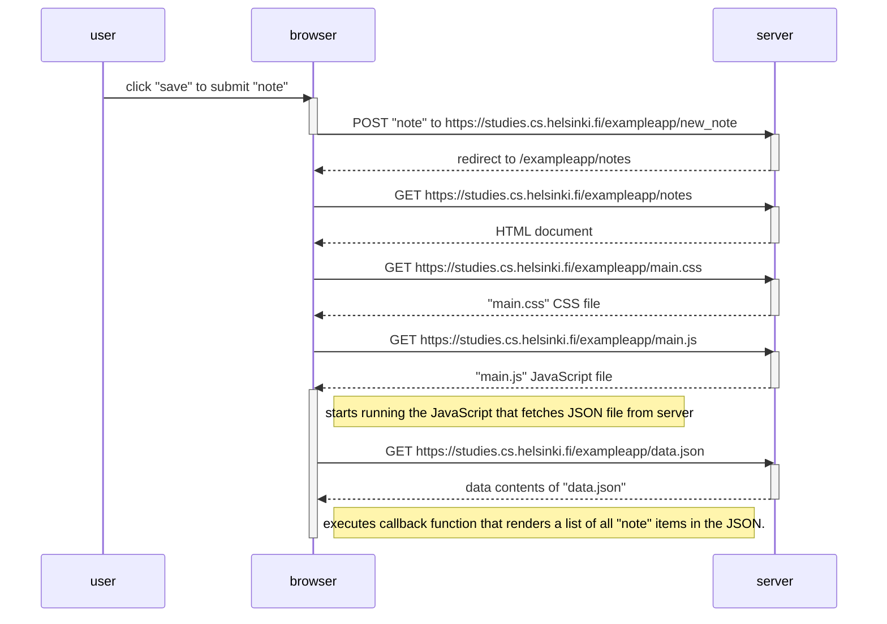

```mermaid
    sequenceDiagram
        participant user
        participant browser
        participant server
        
        user->>browser: click "save" to submit "note"
        
        activate browser
        browser->>server: POST "note" to https://studies.cs.helsinki.fi/exampleapp/new_note
        deactivate browser
        activate server
        server-->>browser: redirect to /exampleapp/notes
        deactivate server
        
        browser->>server: GET https://studies.cs.helsinki.fi/exampleapp/notes
        activate server
        server-->>browser: HTML document
        deactivate server
        
        browser->>server: GET https://studies.cs.helsinki.fi/exampleapp/main.css
        activate server
        server-->>browser: "main.css" CSS file
        deactivate server
        
        browser->>server: GET https://studies.cs.helsinki.fi/exampleapp/main.js
        activate server
        server-->>browser: "main.js" JavaScript file
        deactivate server
    
        activate browser
        note right of browser: starts running the JavaScript that fetches JSON file from server
        
        browser->>server: GET https://studies.cs.helsinki.fi/exampleapp/data.json
        activate server
        server-->>browser: data contents of "data.json"
        deactivate server
        
        note right of browser: executes callback function that renders a list of all "note" items in the JSON.
        deactivate browser
```