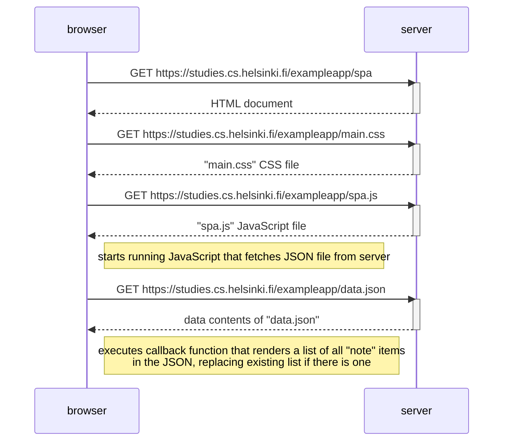

```mermaid
    sequenceDiagram
        participant browser
        participant server

        browser->>server: GET https://studies.cs.helsinki.fi/exampleapp/spa
        activate server
        server-->>browser: HTML document
        deactivate server

        browser->>server: GET https://studies.cs.helsinki.fi/exampleapp/main.css
        activate server
        server-->>browser: "main.css" CSS file
        deactivate server
        
        browser->>server: GET https://studies.cs.helsinki.fi/exampleapp/spa.js
        activate server
        server-->>browser: "spa.js" JavaScript file
        deactivate server
    
        note right of browser: starts running JavaScript that fetches JSON file from server
        
        browser->>server: GET https://studies.cs.helsinki.fi/exampleapp/data.json
        activate server
        server-->>browser: data contents of "data.json"
        deactivate server
        
        note right of browser: executes callback function that renders a list of all "note" items <br>in the JSON, replacing existing list if there is one
```