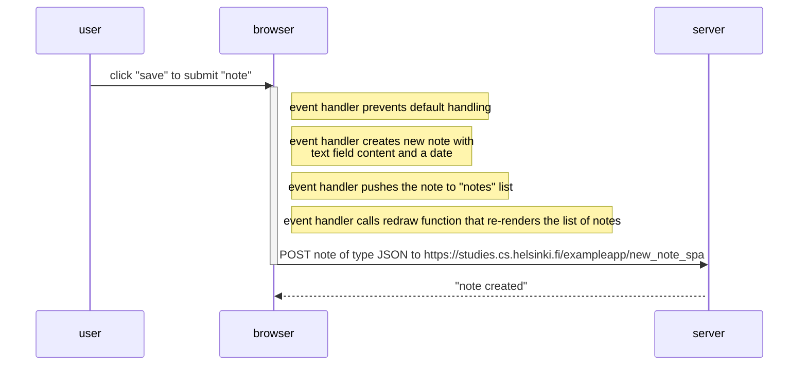

```mermaid
    sequenceDiagram
        participant user
        participant browser
        participant server
        
        user->>browser: click "save" to submit "note"
        activate browser
        note right of browser: event handler prevents default handling
        note right of browser: event handler creates new note with<br>text field content and a date 
        note right of browser: event handler pushes the note to "notes" list
        note right of browser: event handler calls redraw function that re-renders the list of notes

        browser->>server: POST note of type JSON to https://studies.cs.helsinki.fi/exampleapp/new_note_spa
        deactivate browser
        activate server
        server-->>browser: "note created"

```